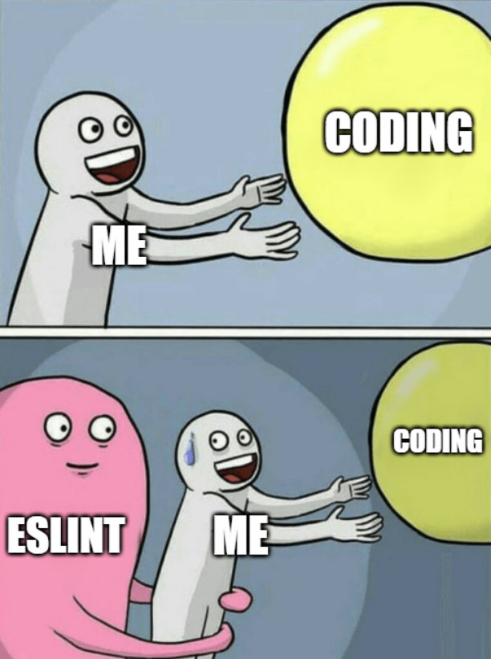

 

<br> 

# Frustration

Using ESLint is something that I've never done before. Typically for school assignments and big coding projects, I just coded in my own style, in a way that felt like it was right and it was comfortable for me. When we started using ESLint, it was a totally different experience for me that often left me confused and frustrated. Take this example: 


```typescript
console.log("Hello World!");
```

Which resulted in these errors: 

```bash
error: Strings must use singlequote 
error: Newline required at end of file but not found 
```

When I saw these errors, the dread started creeping inside of me. Assignments, WODs, and in-class exercises got way harder as I would have to butt heads with the linter to fix problems - that to me - didn't really seem like an issue or something that would cause headaches for myself or other developers analyzing the code.

# Understanding

With the help of the practice WODs and in-class exercises, I slowly started getting used to the linter enforcing the rules of how I should structure my code. Strings started using single quotes. Newlines are now at the end of files. There's no trailing whitespace at the end of a line. 

What I found was that my code became clearer. Certain segments of code were much more readable thanks to the rules enforced by ESLint. Not only that, it helped me to understand the meaning or purpose behind certain pieces of code. Something as simple as changing this: 

`let arr:number[] = [];`

to this: 

`const arr:number[] = [];`

Helped me to see why this segment is the way it is. 

# Acceptance

Coding standards and the use of linting tools like ESLint is a massive headache at first. However, they help developers achieve a consistent structure to their code blocks that follows best practices. Which ensures that your code maintains readability for yourself (when you eventually take a break from this project and need to refresh your memory) and for other developers who may be contributing to your project for the first time. It is important that every file and every piece of code follows some sort of standard for whatever programming language that you are using to maintain some sort of uniformity for your code. 