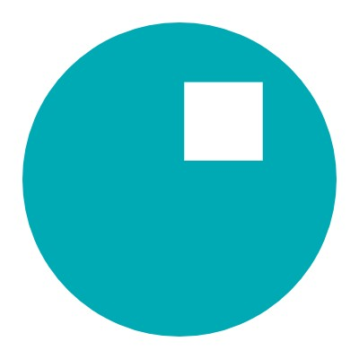

The web development club that I am apart of, 8Bit, created this project as a way to help the ICS community at UH. 
Compscihi is a website that is open to UH Mānoa students to help them find and apply to tech related jobs. When a student goes 
onto the portal, they will see vital information about that job such as: job type, job location, description, preferred qualifications, application link, and so much more!

My role in the Compscihi project was to develop user-friendly components in React + TypeScript that were also responsive. Particularly, I worked on the footer and opportunity (individual) component. Another contribution that I got to do was to help design the layout for the login and sign in page. 

This project helped me get initial exposure to popular web development frameworks such as React and Django that help developers today make web applications. Not only that, these projects helped me gain knowledge in other concepts for software development, things like CI and CD pipelines via Github Actions to automate how we deploy and push code is something that I think is super vital to understand as a developer that isn't really encountered in schools until you reach the higher level courses. 

**Links:**

- Source Code: [https://github.com/8bitUHM/compscihi](https://github.com/8bitUHM/compscihi)
- See Website: [https://compscihi.com](https://compscihi.com)
