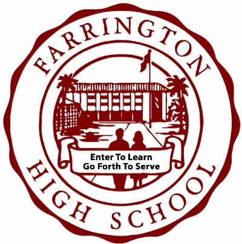

**In Progress**

At Farrington High School, they have a program called Advanced Placement (or AP) that allows students to take college-level courses while in high school to prepare them for the academic rigor of college and also give them a chance to earn college credit. I am creating this website as a way to promote the AP program to students and help them find out what courses are offered at Farrington and also any AP related events/socials. 

Right now, I am the only developer for FHS Academics and I am using React with TypeScript, and Tailwind for the frontend, while using Django (Python) for the backend. I have created some core features for the backend, primarily the feature where admins can post AP Courses offered at Farrington and also post any Events with a Date and Time. On the frontend, I am starting to work on pulling the data from the server and styling them to make them look nice and aesthetically pleasing. 

Overall, this project is helping me to refine my skills in full-stack development. Particularly, the most useful concept I learned was how to structure a project, what I mean is how the folder directory / structure should look like for the project. I think the folder structure is important because it can give you insight on what kind of code to expect in each folder and help make the project a bit easier to understand for development.

**Link(s):**

- Source Code: [https://github.com/LeviKuhaulua/fhsacademics/tree/main](https://github.com/LeviKuhaulua/fhsacademics/tree/main)